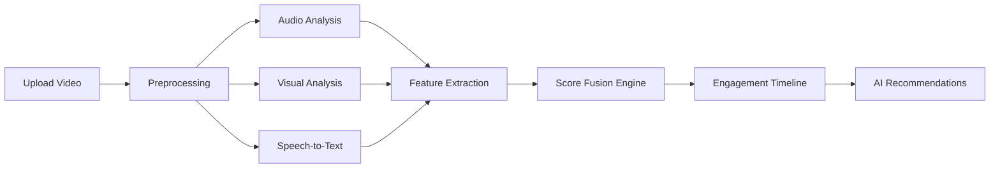

# 🎥 Video Doctor

### AI-Powered Video Engagement Analyzer

🚀 **Analyze. Diagnose. Fix. Go Viral.**

Video Doctor is an AI-driven system that analyzes videos frame-by-frame and second-by-second to identify *why viewers drop off* and *how to fix it*. It combines **audio, visual, and language intelligence** to generate actionable insights for improving engagement.

---

## 🌟 Key Features

* 🎯 **Second-by-Second Engagement Analysis**

  * Detects dips and peaks in viewer retention
  * Highlights exact timestamps where users lose interest

* 🧠 **Multi-Modal AI Analysis**

  * 🎤 Audio: Voice energy, clarity, variation
  * 🎥 Visual: Scene changes, motion, brightness
  * 📝 NLP: Script quality, sentiment, clarity

* 📉 **Drop-Off Cause Detection**

  * Identifies weakest signal (audio / visual / narrative)
  * Explains *why engagement drops*

* ⚡ **AI-Powered Quick Fixes**

  * Suggests improvements for each timestamp
  * Tailored recommendations (hook, pacing, visuals, tone)

* 📊 **Engagement Score Fusion**

  * Combines multiple signals into a single retention score

* 🔐 **User Authentication**

  * Login / Signup system
  * Saves analysis history

* 📁 **Video Upload + Processing Pipeline**

  * Upload → Process → Analyze → Visualize

---

## 🧠 How It Works



---

## 🏗️ Tech Stack

### 🔹 Backend

* **Python + FastAPI** – API layer
* **Whisper** – Speech-to-text transcription
* **Librosa** – Audio signal analysis
* **OpenCV** – Frame & visual processing
* **TextBlob** – NLP & sentiment analysis
* **SQLite** – Lightweight database
* **JWT Auth** – Secure authentication
* **FFmpeg** – Video/audio preprocessing

### 🔹 AI / Intelligence Layer

* Multi-modal scoring system:

  ```
  Engagement Score = 
  (Visual × Weight) + (Audio × Weight) + (NLP × Weight)
  ```
* **LLM Integration (Gemini API)** for smart recommendations

### 🔹 Frontend

* **React (Vite)** – UI framework
* **Context API** – State management
* **Custom Dashboard UI** – Upload, analyze, visualize

---

## 📂 Project Structure

```
video_doctor/
│
├── backend/
│   ├── main.py              # FastAPI entry point
│   ├── analyzer.py          # Core analysis logic
│   ├── fusion.py            # Score fusion engine
│   ├── llm.py               # AI recommendations
│   ├── auth/                # Authentication system
│   ├── database.py          # DB config
│   └── requirements.txt
│
├── frontend/
│   ├── src/
│   │   ├── components/
│   │   ├── pages/
│   │   ├── context/
│   │   └── App.jsx
│   └── package.json
│
└── README.md
```

---

## ⚙️ Setup & Installation

### 🔹 1. Clone Repository

```bash
git clone https://github.com/Shaikh-Mohammad-Faizan/video_doctor.git
cd video_doctor
```

---

### 🔹 2. Backend Setup

```bash
cd backend

# Create virtual environment
python -m venv venv

# Activate (Windows)
venv\Scripts\activate

# Install dependencies
pip install -r requirements.txt
```

---

### 🔹 3. Environment Variables

Create a `.env` file inside `backend/`:

```env
GEMINI_API_KEY=your_api_key_here
SECRET_KEY=your_secret_key
```

---

### 🔹 4. Run Backend

```bash
uvicorn main:app --reload
```

Backend runs at:
👉 http://127.0.0.1:8000

---

### 🔹 5. Frontend Setup

```bash
cd frontend
npm install
npm run dev
```

Frontend runs at:
👉 http://localhost:5173

---

## 📡 API Endpoints

| Endpoint           | Description                        |
| ------------------ | ---------------------------------- |
| `/analyze`         | Upload and analyze video           |
| `/status/{job_id}` | Check processing status            |
| `/demo/{video}`    | Run demo analysis                  |
| `/viral-baseline`  | Compare against viral metrics      |
| `/social-compare`  | Compare with social media patterns |
| `/auth/*`          | Login / Signup                     |

---

## 💡 Real-World Use Case

> Imagine uploading a reel and getting this insight:
>
> ❌ *"At 0:08, viewers drop because voice energy drops and visuals remain static."*
> ✅ *"Fix: Add visual transition + increase tone variation."*

This transforms creators from guessing → **data-driven storytelling**.

---

## 🧪 Demo Flow (For Hackathon)

1. Upload video
2. Wait for processing
3. View engagement timeline
4. Hover over dips
5. Show AI explanation
6. Display quick fixes

🔥 **WOW Factor:**
Real-time, explainable AI + timestamp-level insights

---

## 🚀 Future Enhancements

* 📱 Mobile app support
* 🌍 Multi-language analysis
* 📊 Social media dataset integration
* 🤖 Advanced deep learning models
* ☁️ Cloud deployment at scale

---

## ⚠️ Security Note

* Remove `.env` file before pushing to GitHub
* Do not expose API keys
* Use environment variables for secrets

---

## 👨‍💻 Author

Built as a hackathon-ready AI system focused on real-world impact and strong demo value.

---

## ⭐ If You Like This Project

Give it a ⭐ on GitHub and share it 🚀

---
